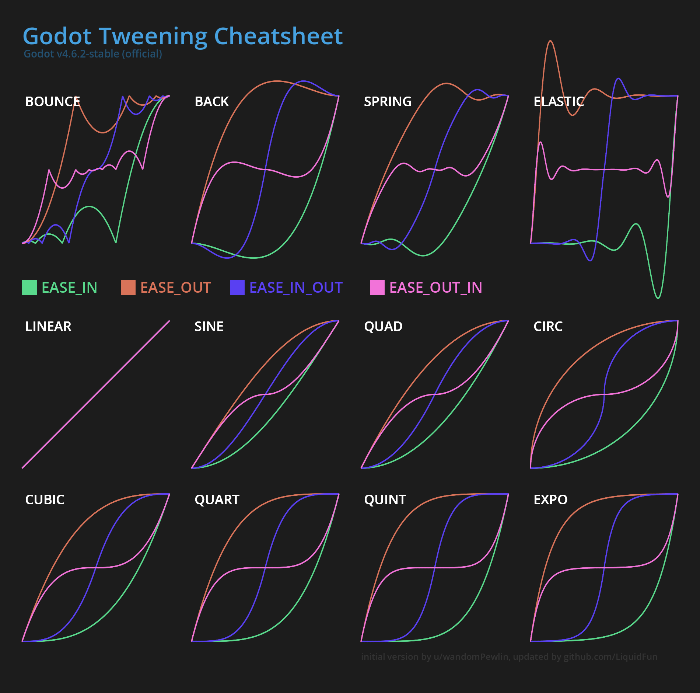

# Godot Tweening Cheatsheet

Heavily inspired by [u/wandomPewlin's](https://www.reddit.com/r/godot/comments/frqzup/godot_tweening_cheat_sheet/) cheatsheet, but updated for Godot 4, added `Tween.TRANS_SPRING` and grouped in a different way.
