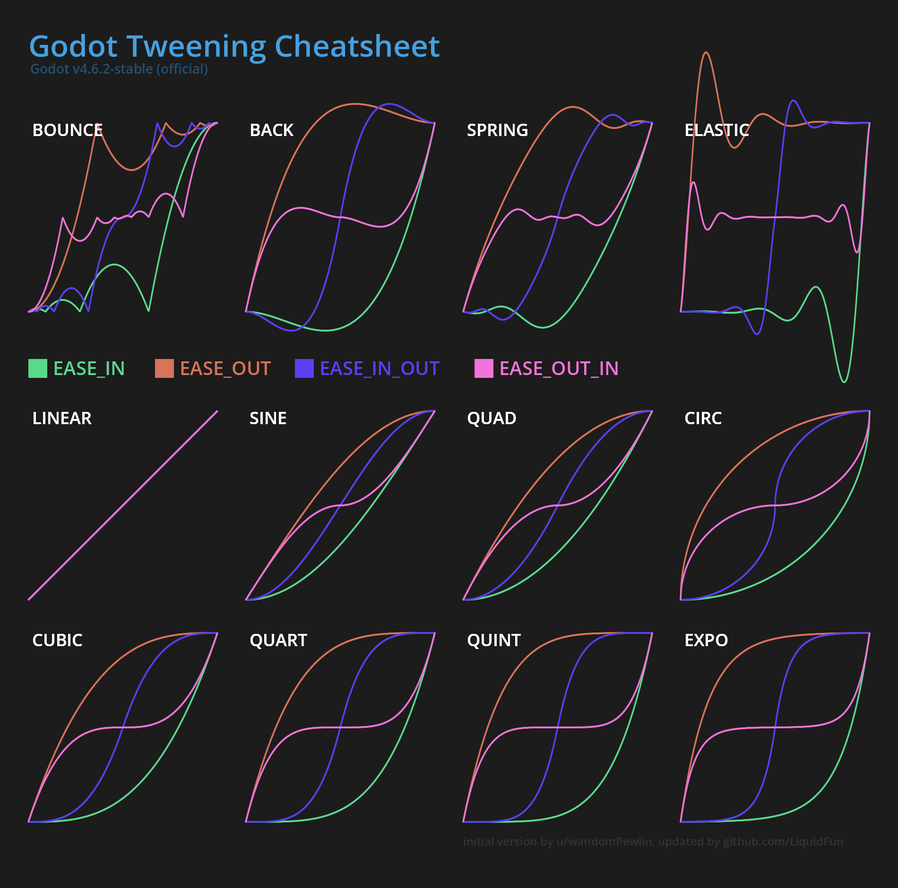
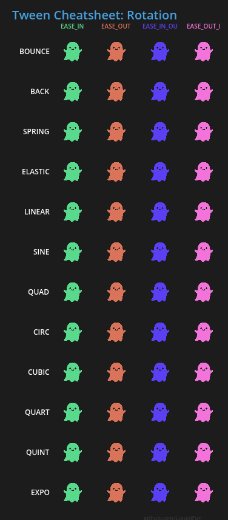
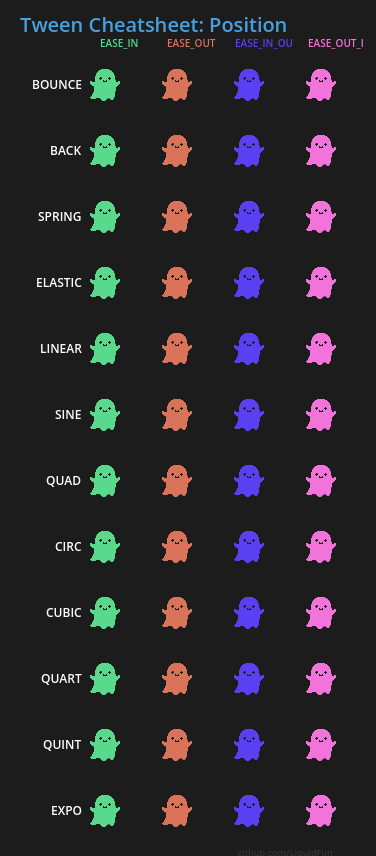
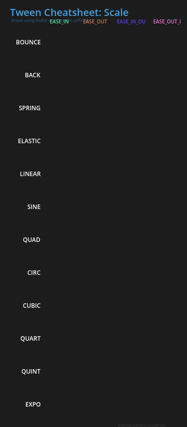
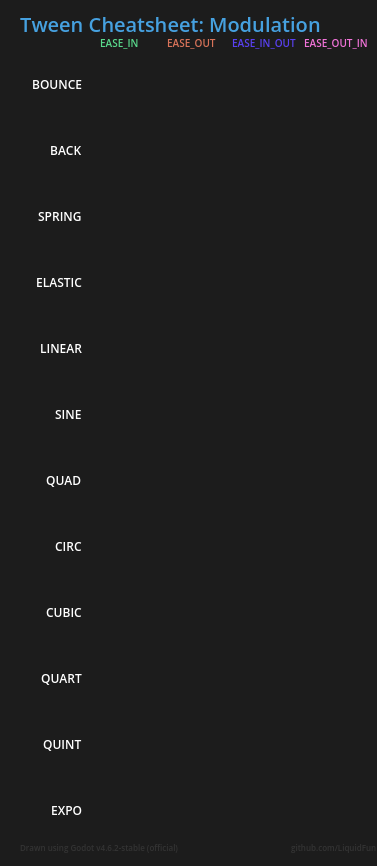

# Godot Tweening Cheatsheet

Heavily inspired by [u/wandomPewlin's](https://www.reddit.com/r/godot/comments/frqzup/godot_tweening_cheat_sheet/) cheatsheet, but updated for Godot 4, increased resolution, added `Tween.TRANS_SPRING` and grouped in a different way. 

Their guide was by far the best visual guide for tweens in Godot I have found. 
There are indeed a lot of interactive tools which visualize tweens and animations, and for exploring initially they are indeed a decent resource.
However, usually when you need such a guide is when you are in a rush and want to quickly look up how the tweens "feel", for this you need high visual density.
Most of the interactive sites require you to click through all the transitions and easings, which is just terrible UX.

But in recreating it I did want to improve a few things I have noticed over the years (this is likely my most used godot resource). 
One thing heavily disliked is the visual grouping of the transitions.
In my mind there are four different identities of transitions, which inspires the grouping in the image above:

* Linear - the most basic, it's not really a tween per-se, more the lack there-of. However I believe it's important to keep it, as it gives important intuition for the easings. When you start out tweening, it's entirely not obvious that linear transition with any easing produces the same, linear "curve". Keeping it in explains this. The problem with `linear` though is that it does not make sense physically. Objects or state does not change like this, things have mass, velocity, momentum, whatever. They generally have to accelerate or stop for some reason, and `linear` does not communicate this well.
* Smooth Monotic - sine, quad, cubic, quart, quint, expo, circ (in that order) - these are in my mind kind of the same tween with a different steepness to them. All of them are simply monotically increasing, but still are "real" tweens in that they are used to smooth out an animation. Essentially the further right in the list you go, the snappier the tween fill feel. However, the ordering is not quite trivial. Sine through expo is I believe obvious, but placing `circ` is not. The problem with circ is that it looks like it's similar-ish to `cubic` based on the shape and for now I have placed it there because that looks visually more satisfying the graph. When thinking about it from an intensity perspective, I believe it's better placed at the end, after `expo`. The reason for this is that `circ` is the only tween which has essentially infinite steepness at either end of the curve, which makes it feel very snappy. You may look at the animation position gif, you will see circ looks much more like expo than the "weaker" tweens.
* Springy - `back`, `spring`, `elastic` - in that order, has the same identity, but essentially only increasing in strength and snappiness. This relationship between them is visually not that apparent though, however you have to keep in mind, that you can always scale the time as well in a tween, and if you make spring twice as fast, it obtains the same shape as `elastic`.
* Bouncy - `bounce` is in my mind kind of the opposite of something like `elastic`, in the sense that it answers the question of "what makes my object stop?" differently. For `bounce` it stops because there is something the animation cannot overcome (say, a wall), so that it cannot overshoot it. While `elastic` and the entire springy group allows the animation to overshoot and has some spring which holds in place.

Thinking about tweens in this grouping allows you much quicker and easier decision-making. When tweening or animating something you first decide whether you want a smooth monotic, springy or bouncy animation tween (you barely ever want to use linear), and at the second step you decide what intensity you want for it. The decision to use which of the three groups largely depends on what you are animating or transitioning. There isn't one perfect transition or easing. In general it depends on what makes sense I give more concrete examples for common animations below.

In general, the question "What makes my property move?" and "What makes my property stop?" can help choosing a transition+easing combination. For example, if the object receives a strong initial impulse (kicking a ball), then you want to use `ease-out`. If the ball simply flies of into the distance, only stopped slowly by air resistance you want some smooth monotic transition, such as `cubic`. If the football hits a wall you may use `bounce` with `ease-out` (well, this is probably not something you want to solve with a tween, but sometimes it might be enough). 

It's important to keep in mind that tweens always have a duration as well, and of course this is "obvious", but it's easy to overdo or to forget what's the point of your animation or transition even is. Whenever a player or user action directly causes something to move, you most likely want `ease-out` and a very short duration the user does not _need_ that transition to know that - they caused it! Of course this depends on the game, and whether the action is something where the user does not know what happens, in that case a longer duration can help communicate in what way your property changes. The tween transition type and easing itself only makes it more satisfying and believable. 

A long animation duration does make sense and is important for cases where something was not caused by the user. An example I notice often in something like esports UIs is this: you watch a esports for a game like league of legends, there is an additional HUD giving the viewer information. Say, there are some global objectives which are tracked either by a counter or by some tokens (e.g. number of slain dragons). One of the teams claims such an objective, and you glance over to the token counter to see how many of the objectives the team has acquired so far. However, the HUD programmers have made the mistake of only polling every second for the objective count, therefore, the moment you look at the counter you don't know whether it has already changed. So you have to keep looking for a second or two to see if it changes. This is terrible UX! This could of course be solved with a signal-based architecture, where the HUD is notified about changes. However, suppose the HUD programmers cannot influence this, as this is a big architectural decision. In that case animation is exactly what you need - it communicates the change of state to the user, and in this case it can be a second long, in fact it can be longer. This allows the viewer to notice that the counter or transition is currently changing, without having to speculate if it was already updated.

## Applied to the big four

Below I show the all of transition+easing combinations applied to the main four properties you want to tween: "rotation", "position", "scale" and "modulation". You likely want to use different transitions with different easings for each one, depending on the use case. Keep in mind that you have another variable you can change - the duration - which can make one transition feel like another one.

<table>
<tr>
<td align="center"><strong>Rotation</strong></td>
<td align="center"><strong>Position</strong></td>
</tr>
<tr>
<td></td>
<td></td>
</tr>
<tr>
<td align="center"><strong>Scale</strong></td>
<td align="center"><strong>Modulation</strong></td>
</tr>
<tr>
<td></td>
<td></td>
</tr>
</table>
